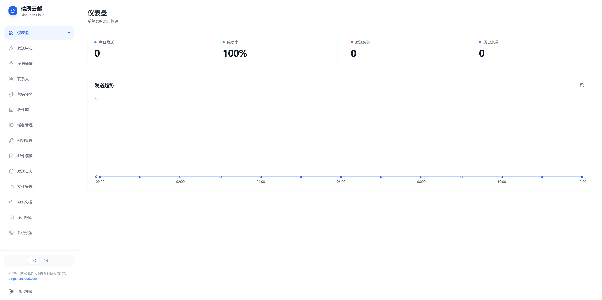
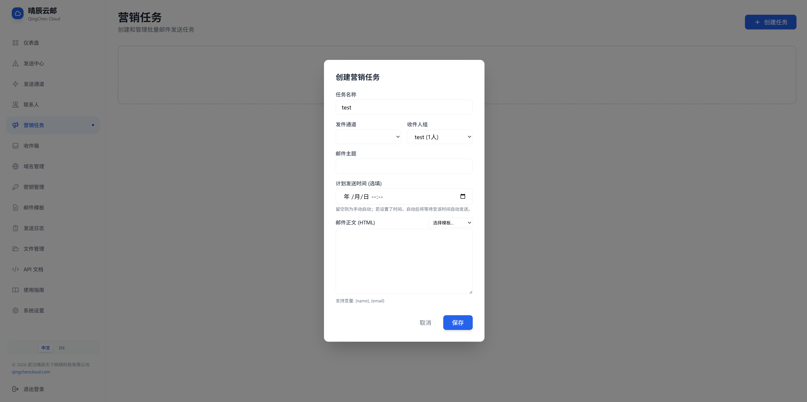
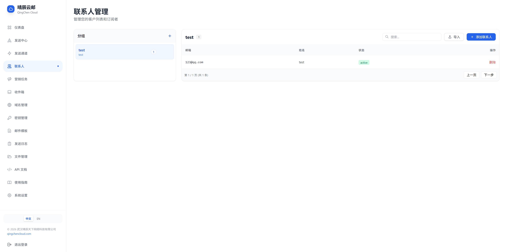
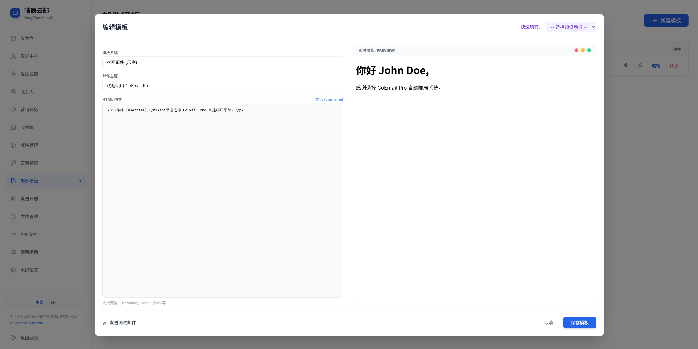
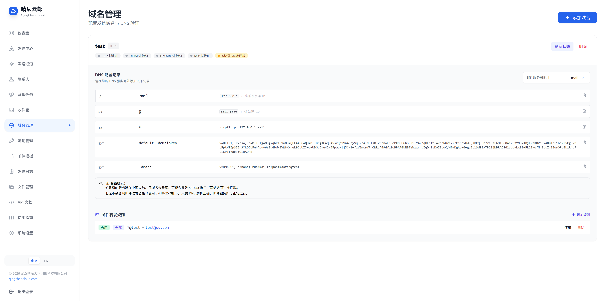
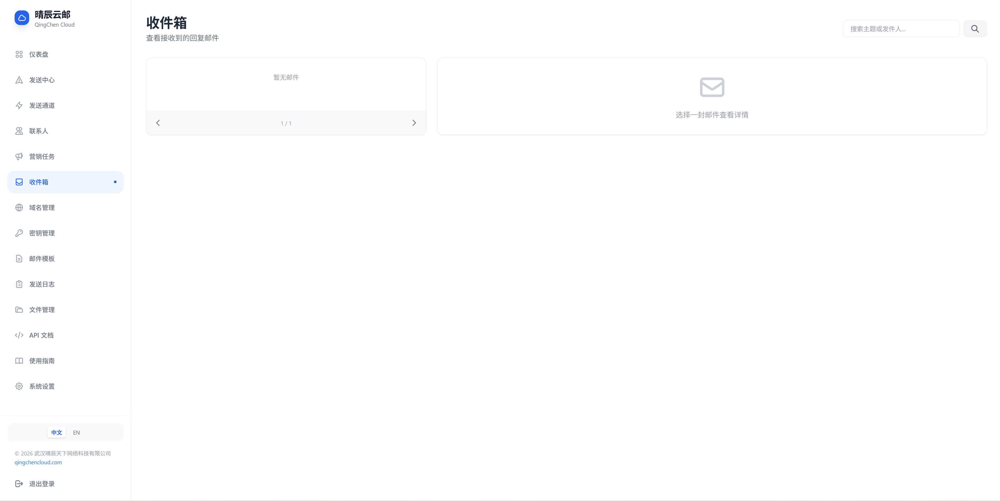
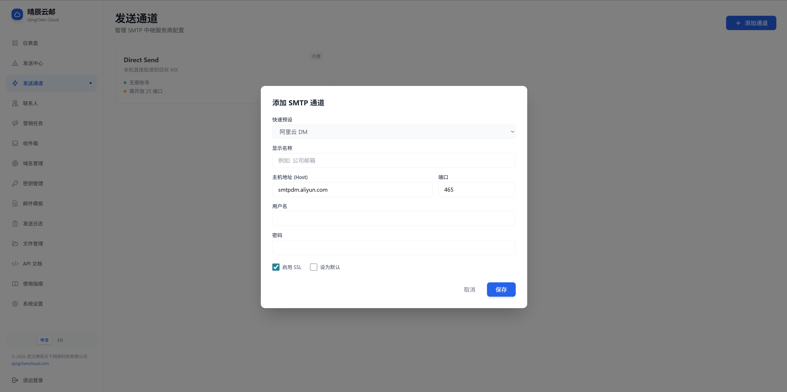
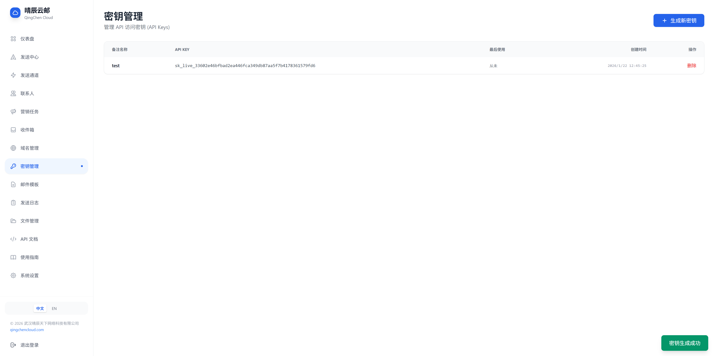
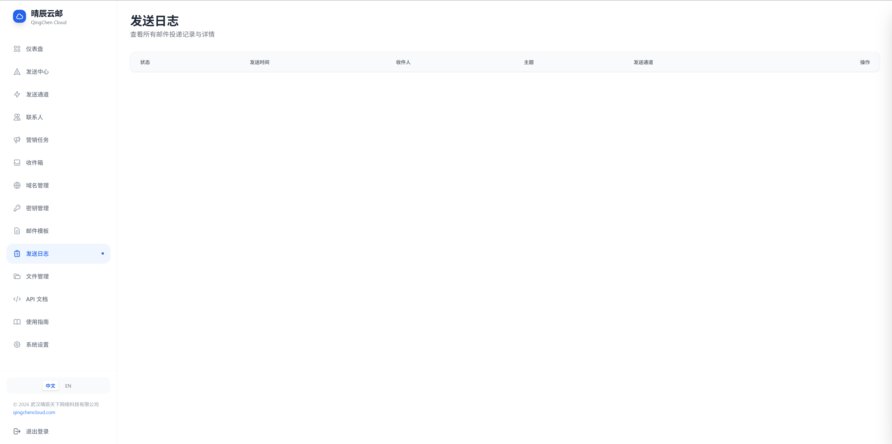
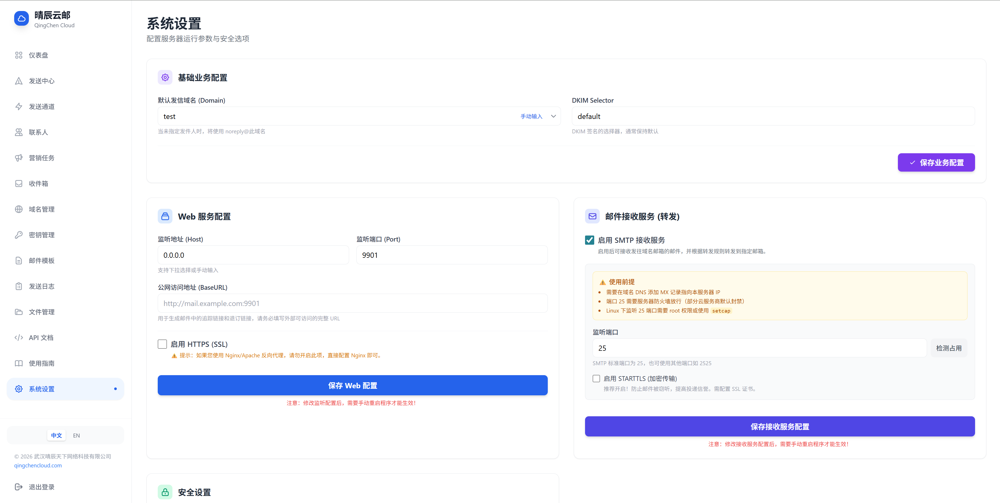

<h1 align="center">速信云邮 Suxin Mail</h1>

<p align="center">
  <strong>🚀 企业级自建邮件系统 · 发送/接收/营销一站式解决方案</strong>
</p>


<p align="center">
  <a href="README.md">中文</a> · <a href="docs/README_en.md">English</a> · <a href="docs/INSTALL_zh-CN.md">部署指南</a> · <a href="[https://github.com/1186258278/SuxinMail](https://github.com/suxinwl/SuMail/)releases">下载</a>
</p>

---

## 💡 为什么选择速信云邮？

| 痛点 | 传统方案 | 速信云邮 |
|:---:|:---:|:---:|
| **成本** | 第三方 EDM 按量计费，邮件越多越贵 | **一次部署，永久免费** |
| **隐私** | 邮件内容经第三方服务器，存在泄露风险 | **数据 100% 自有掌控** |
| **灵活性** | API 受限，无法定制 | **开源可改，RESTful API 全开放** |
| **送达率** | 共享 IP 易被标记垃圾 | **独立 IP + DKIM/SPF/DMARC 自动配置** |

---

## ✨ 核心能力

<table>
<tr>
<td width="50%">

### 📤 智能发信引擎

- **双模式投递**: 直连发送 + SMTP 中继智能切换
- **高送达率**: 自动 DKIM 签名 + SPF/DMARC 记录生成
- **子域名隔离**: 营销邮件与事务邮件分离，保护主域信誉
- **异步队列**: 内置高性能队列，支持失败重试与并发控制
- **营销任务**: 支持暂停/恢复、实时进度追踪、打开率统计

</td>
<td width="50%">

### 📥 邮件网关

- **SMTP 收信**: 内置 SMTP Server，接收域名邮箱邮件
- **STARTTLS 加密**: 支持 TLS 加密传输，防窃听
- **智能转发**: 通配符/前缀匹配，自动转发至 Gmail/QQ
- **MIME 解析**: 自动解码 Base64/QP，支持中文无乱码
- **附件处理**: 自动提取保存，支持在线预览

</td>
</tr>
<tr>
<td>

### 🛡️ 安全防护

- **两步验证 (2FA)**: TOTP 动态口令，Google/Microsoft Authenticator 兼容
- **速率限制**: IP 级连接限制，防 DDoS/暴力攻击
- **IP 黑名单**: 一键封禁恶意 IP
- **JWT 认证**: 安全 Token + API Key 双重验证
- **密码加密**: bcrypt 哈希存储
- **HTTPS 支持**: 全站 SSL 加密
- **证书管理**: Let's Encrypt 自动申请/续期，支持手动上传
- **自动备份**: 更新前自动备份，支持一键回滚

</td>
<td>

### 🔧 开发者友好

- **RESTful API**: 标准接口，支持 Bearer Token
- **永久密钥**: `your_api_key_here` 格式，集成方便
- **模板引擎**: `{{.name}}` 变量替换，千人千面
- **Webhook 回调**: 发送状态实时推送
- **交互式文档**: 内置 API 文档 + AI 提示词
- **在线更新**: 一键检查/下载/安装新版本
- **热重启**: 更新后自动重启，无需人工干预

</td>
</tr>
</table>

---

## 🖼️ 系统预览

<table>
<tr>
<td align="center"><b>仪表盘</b><br></td>
<td align="center"><b>营销任务</b><br></td>
</tr>
<tr>
<td align="center"><b>联系人管理</b><br></td>
<td align="center"><b>邮件模板</b><br></td>
</tr>
<tr>
<td align="center"><b>域名配置</b><br></td>
<td align="center"><b>收件箱</b><br></td>
</tr>
</table>

<details>
<summary>📸 查看更多截图</summary>

| 发送通道 | 密钥管理 |
|:---:|:---:|
|  |  |

| 发送日志 | 系统设置 |
|:---:|:---:|
|  |  |

</details>

---

## 🚀 快速开始

### 1️⃣ 下载运行

```bash
# 从 Releases 下载对应平台二进制文件
# https://github.com/1186258278/SuxinMail/releases

# Linux/macOS
chmod +x goemail && ./goemail

# Windows
goemail.exe
```

### 2️⃣ 访问后台

浏览器打开 `http://localhost:9901`

| 项目 | 值 |
|:---:|:---:|
| 默认账号 | `admin` |
| 默认密码 | `123456` |

> ⚠️ **首次登录后请立即修改密码，并建议开启两步验证 (2FA)！**

### 命令行参数

```bash
# 重置管理员密码为 123456
./goemail -reset

# 重置管理员两步验证 (忘记 2FA 时使用)
./goemail -reset-totp
```

### 3️⃣ 发送第一封邮件

```bash
curl -X POST http://localhost:9901/api/v1/send \
  -H "Authorization: Bearer sk_your_api_key" \
  -H "Content-Type: application/json" \
  -d '{
    "to": "test@example.com",
    "subject": "Hello from Suxin Mail",
    "body": "<h1>欢迎使用速信云邮！</h1>"
  }'
```

---

## 📦 功能清单

| 模块 | 功能 | 状态 |
|:---|:---|:---:|
| **发送中心** | 单封/批量发送、附件支持、HTML 模板 | ✅ |
| **营销任务** | 定时发送、暂停恢复、进度追踪、统计分析 | ✅ |
| **联系人** | 分组管理、导入导出、退订管理 | ✅ |
| **收件箱** | SMTP 收信、MIME 解析、附件提取、批量操作 | ✅ |
| **转发规则** | 精确/前缀/通配符匹配、多目标转发 | ✅ |
| **域名管理** | 多域名支持、DKIM 自动生成、DNS 验证 | ✅ |
| **发送通道** | SMTP 中继配置、直连发送、负载均衡 | ✅ |
| **安全防护** | **2FA 两步验证**、STARTTLS、速率限制、IP 黑名单 | ✅ |
| **证书管理** | Let's Encrypt 自动申请、手动上传、自动续期 | ✅ |
| **数据清理** | 自动定时清理、保留策略配置、手动清理 | ✅ |
| **系统设置** | HTTPS、端口配置、备份恢复 | ✅ |
| **API** | RESTful 接口、永久密钥、交互文档 | ✅ |

---

## ⚙️ 配置说明

<details>
<summary>📝 config.json 示例</summary>

```json
{
  "domain": "mail.example.com",
  "host": "0.0.0.0",
  "port": "9901",
  "base_url": "https://mail.example.com",
  "enable_ssl": false,
  "enable_receiver": true,
  "receiver_port": "25",
  "receiver_tls": true,
  "receiver_rate_limit": 30,
  "receiver_max_msg_size": 10240,
  "cleanup_enabled": true,
  "cleanup_email_log_days": 30,
  "cleanup_inbox_days": 30
}
```

</details>

<details>
<summary>🔐 DNS 记录配置</summary>

```
# MX 记录 (收件)
@    MX    10    mail.example.com.

# SPF 记录 (发件验证)
@    TXT   "v=spf1 ip4:YOUR_SERVER_IP ~all"

# DKIM 记录 (签名验证)
default._domainkey    TXT    "v=DKIM1; k=rsa; p=YOUR_PUBLIC_KEY"

# DMARC 记录 (策略)
_dmarc    TXT    "v=DMARC1; p=quarantine; rua=mailto:admin@example.com"
```

</details>

---

## 🏗️ 技术架构

```
┌─────────────────────────────────────────────────────────────┐
│                      速信云邮 架构图                          │
├─────────────────────────────────────────────────────────────┤
│  ┌─────────┐    ┌─────────┐    ┌─────────┐    ┌─────────┐  │
│  │  Web UI │    │   API   │    │  SMTP   │    │  Queue  │  │
│  │ (HTML5) │    │  (Gin)  │    │ Server  │    │ Worker  │  │
│  └────┬────┘    └────┬────┘    └────┬────┘    └────┬────┘  │
│       │              │              │              │        │
│       └──────────────┴──────────────┴──────────────┘        │
│                          │                                   │
│                    ┌─────┴─────┐                            │
│                    │   GORM    │                            │
│                    │  SQLite   │                            │
│                    └───────────┘                            │
└─────────────────────────────────────────────────────────────┘
```

| 层级 | 技术选型 |
|:---:|:---|
| **后端** | Go 1.21+ · Gin · GORM · SQLite |
| **前端** | HTML5 · TailwindCSS · Chart.js |
| **邮件** | go-mail · go-msgauth (DKIM) · STARTTLS |
| **安全** | bcrypt · JWT · TOTP (2FA) · Rate Limiter |
| **证书** | ACME · Let's Encrypt · lego |

---

## 🤝 参与贡献

欢迎提交 Issue 和 Pull Request！

1. Fork 本仓库
2. 创建特性分支: `git checkout -b feature/amazing-feature`
3. 提交更改: `git commit -m 'feat: add amazing feature'`
4. 推送分支: `git push origin feature/amazing-feature`
5. 提交 PR

详见 [贡献指南](CONTRIBUTING.md)

---

## 📄 开源协议

本项目采用 [MIT License](LICENSE) 许可证，可免费商用。

---

<p align="center">
  <b>© 2026 深圳市速信网络科技有限公司</b><br>
  <a href="https://www.suxinwl.com">官网</a> · 
  <a href="docs/INSTALL_zh-CN.md">文档</a>
</p>

<p align="center">
  如果这个项目对您有帮助，请给一个 ⭐ Star 支持一下！
</p>
