# Suxin Mail

[](../LICENSE)
[](https://golang.org)
[](https://github.com/1186258278/SuxinMail/actions)
[](https://qingchencloud.com)

> Enterprise-grade self-hosted email marketing and delivery solution.

[中文](../README.md) | [English](README_en.md) | [Installation Guide](INSTALL_zh-CN.md)

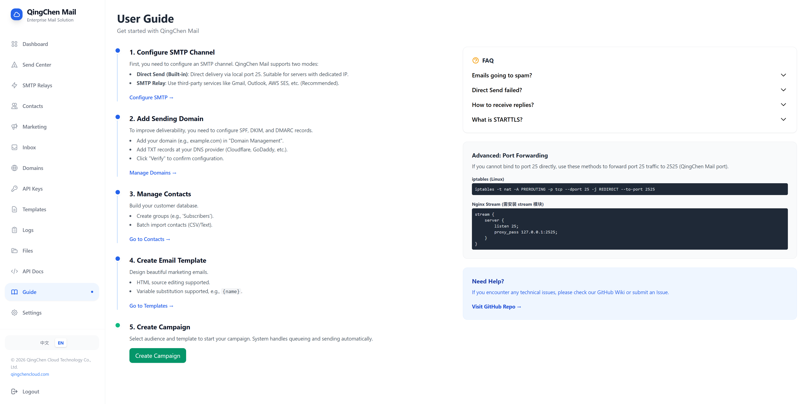

## Overview

Suxin Mail is a high-performance, lightweight email delivery system written in Go. It is designed to replace expensive third-party EDM services with a secure, private, and controllable self-hosted solution.

It supports dual delivery modes (Direct Send & SMTP Relay), automatic DKIM/SPF configuration, and subdomain isolation, ensuring high deliverability and domain reputation protection.

## Key Features

*   **Dual Delivery Modes**:
    *   **Direct Send**: Built-in DNS resolver and MX delivery engine. Supports automatic DKIM signing.
    *   **SMTP Relay**: Seamless integration with third-party relays (Gmail, Outlook, AWS SES, etc.).
*   **High Deliverability**:
    *   **Subdomain Isolation**: Support sending via subdomains (e.g., `support@mail.example.com`) to protect root domain reputation.
    *   **Auto Authentication**: Automated generation of SPF, DKIM, and DMARC records.
*   **Inbound Routing**: Built-in SMTP server for receiving emails with intelligent forwarding rules (wildcard/prefix matching).
*   **Visual Dashboard**: comprehensive management of domains, templates, keys, and logs.
*   **Developer Ready**:
    *   RESTful API with persistent API keys (`your_api_key_here`).
    *   Template engine with variable substitution support.
*   **Zero-Maintenance**:
    *   Single binary deployment.
    *   Auto-calibration of database schema on startup.
    *   **Online Updates**: One-click check/download/install new versions.
    *   **Auto Backup**: Automatic backup before updates with one-click rollback.
    *   **Hot Restart**: Auto-restart after updates without manual intervention.

## Screenshots

| Dashboard | Marketing |
| :---: | :---: |
| 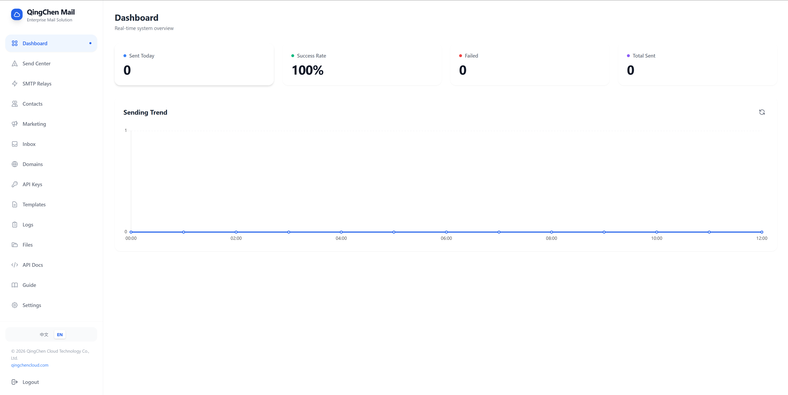 | 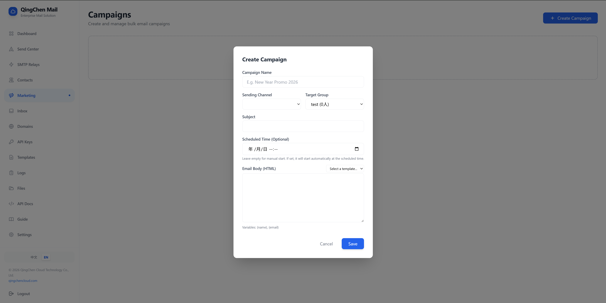 |

| Contacts | Templates |
| :---: | :---: |
| 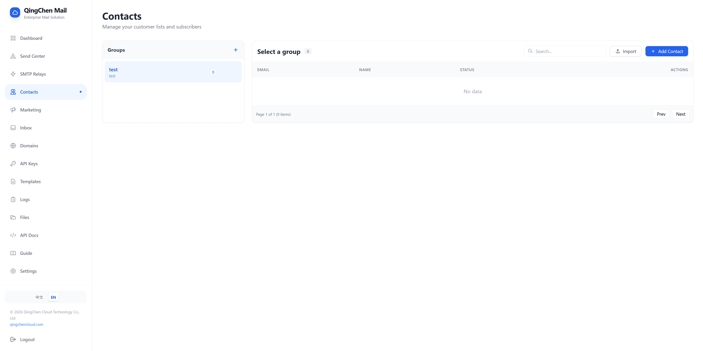 | 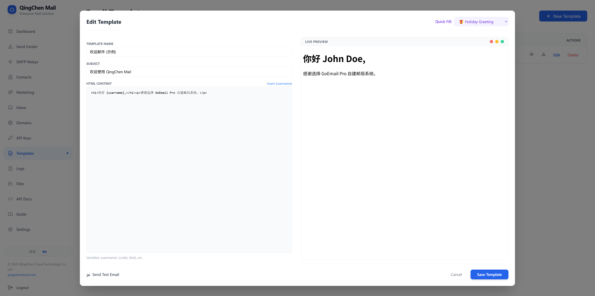 |

| SMTP Relays | Domains |
| :---: | :---: |
| 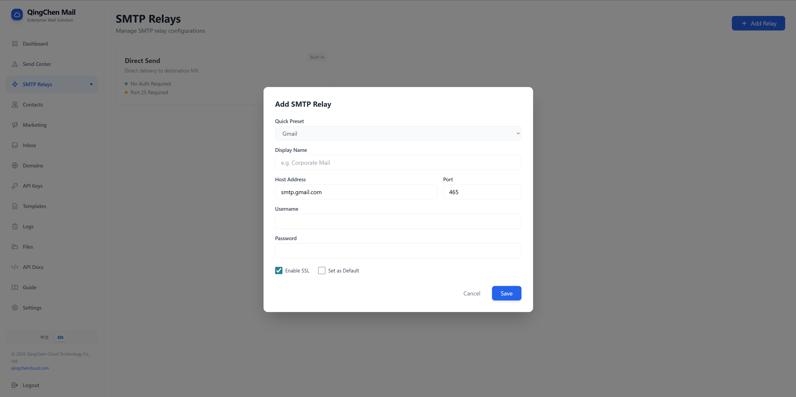 | 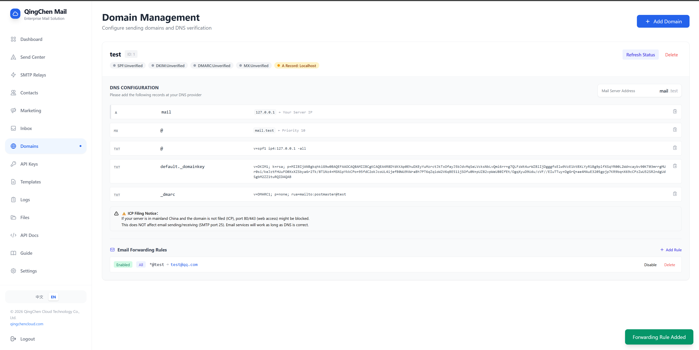 |

| Inbox | API Keys |
| :---: | :---: |
| 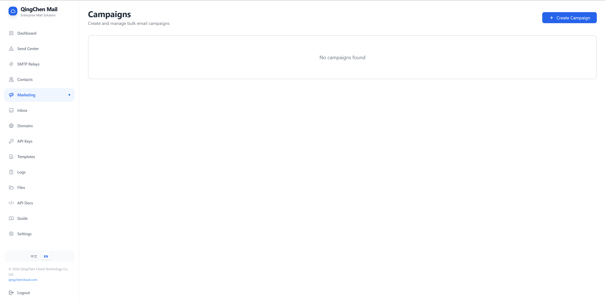 | 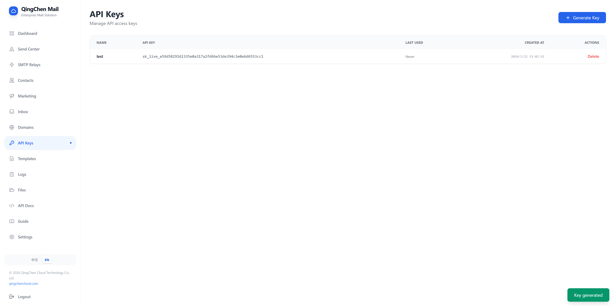 |

| Logs | Login |
| :---: | :---: |
| 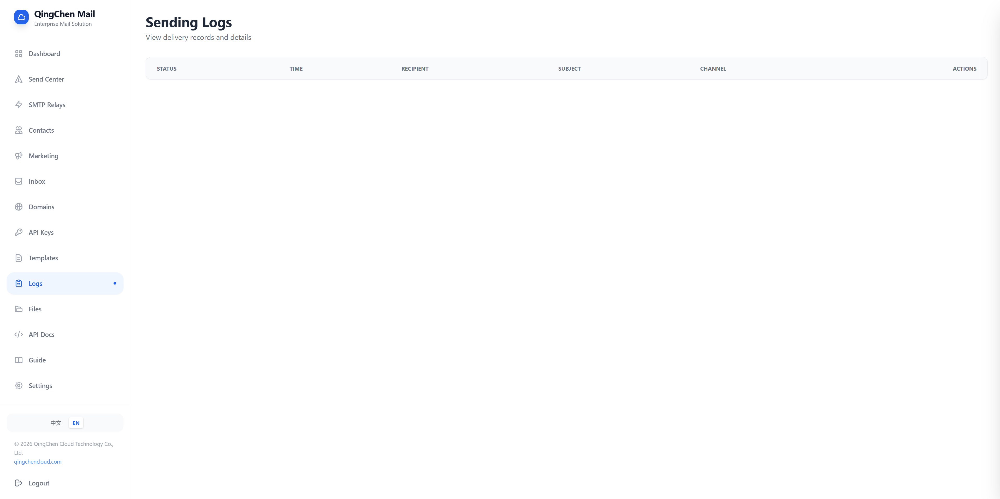 |  |

| Files | Settings |
| :---: | :---: |
| 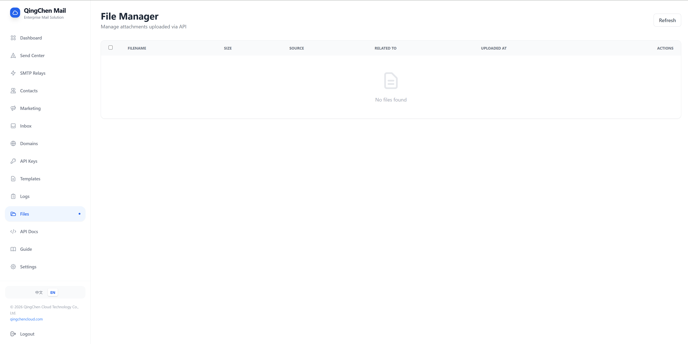 | 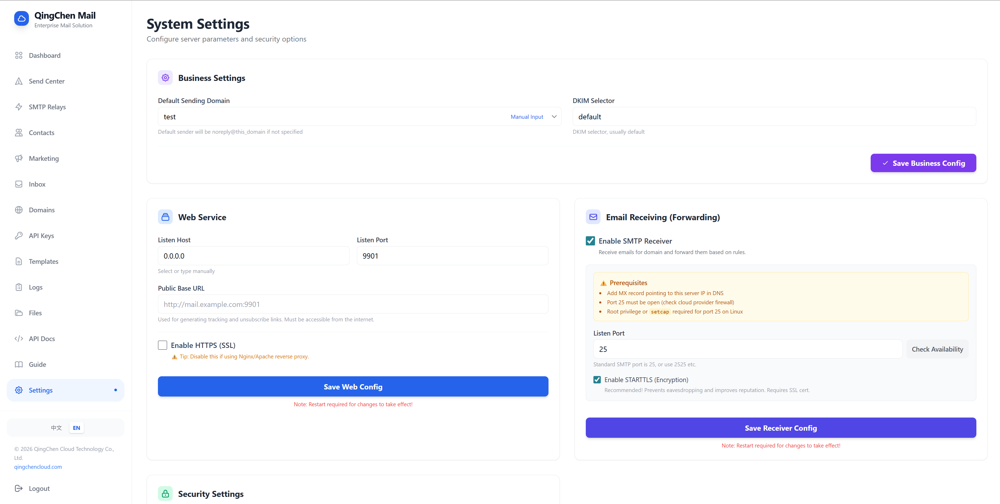 |

## Quick Start

### 1. Download & Run
Download the latest release for your platform and run it directly:

```bash
./goemail
```

### 2. Access Dashboard
Open your browser and visit: `http://localhost:9901`

*   **Default User**: `admin`
*   **Default Password**: `123456` (⚠️ Please change it immediately after login)

### 3. Configuration
For production environments, it is recommended to configure HTTPS and bind to a public IP. Edit `config.json` or use the Settings page in the dashboard.

## Security

**Sensitive Data Warning**:
*   Do NOT commit `config.json` or `goemail.db` to public repositories.
*   Use `config.example.json` as a template for version control.

## License

This project is licensed under the MIT License - see the [LICENSE](../LICENSE) file for details.

---

© 2026 Wuhan QingChen TianXia Network Technology Co., Ltd. All rights reserved.
